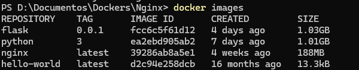
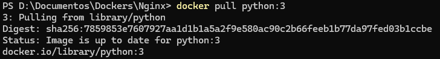
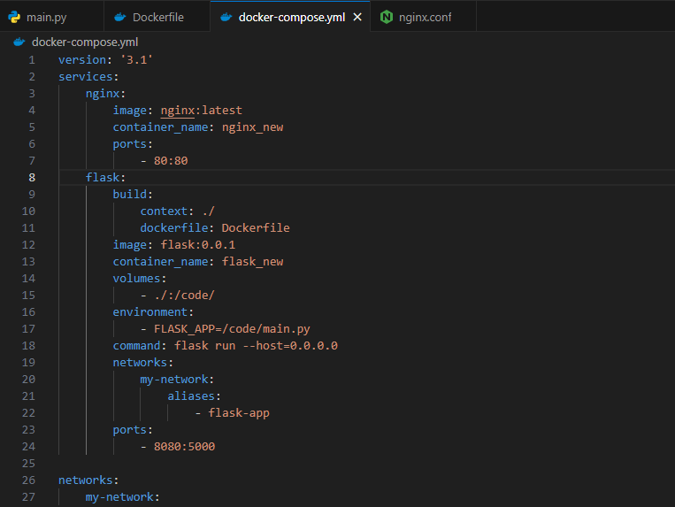
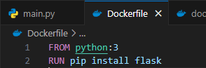
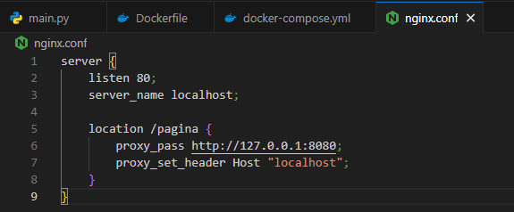
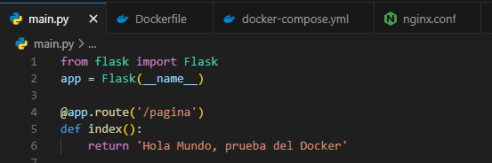

# Docker Proxy

## Requisitos Previos

Es necesario tener instalado [**Docker**](https://docs.docker.com/)

## Instrucciones

Configurar un Docker con Nginx con el puerto 80 para posteriormente instalar dentro de ese Docker Python , crear un usuario y ejecutar el ejemplo de FLASK, configurar proxy para responder por enpoint /pagina para resolver el puerto 5000 del FLASK.

## Proceso

Desde la terminal (en algún lugar o carpeta de nuestro gusto) debemos ejecutar el siguiente comando:

```bash
docker pull nginx
```


En donde con esto nos instalara la version más reciente de nginx, igualmente si queremos alguna versión valida en especifico debemos poner seguido de nginx ":version", como se muestra a continuación, aunque es recomendable tener la versión más actual

```bash
docker pull nginx:1.13.7
```
Posteriormente para poder ver la imagen descargada debemos ejecutar el comando:

```bash
docker images
```


Para crear un Docker, tendremos que ejecutar el siguiente comando:

```bash
docker run --name nombreContenedor -d -p 80:80 nginx
```


En donde se mapea el puerto 80 del Contenedor con el puerto 80 de la maquina, creando así el contenedor de imagen Nginx ('-d' indica que se esta ejecutando el contenedor en 2do plano)

Una vez ya creado el contenedor, podemos verificar su creación ejecutando el comando, que se utiliza para poder listar los contenedores en Docker

```bash
docker ps
```


Para poder detener el contenedor se necesita ejecutar el comando:

```bash
docker stop nombreContenedor
```
Lo siguiente que se tiene que realizar es instalar el contenedor de Python por lo que tenemos que ejecutar el siguiente comando:

```bash
docker pull python:3
```



Despues de instalar el contenedor de Python, nos vamos a dirigir a la ruta en donde se esta almacenando nuestro Docker por lo que vamos a un editor de codigo para añadirle los siguientes archivos:

#### 1. docker-compose.yml
Es un archivo de configuración que se usa para poder definir y ejecutar múltiples servicios Docker dentro de un solo entorno. (Se pueden definir varios atributos como el nombre, version, puertos, etc).




#### 2. Dokerfile
Este archivo que contiene instrucciones para construir una imagen Docker, es decir define el entorno del contenedor (dependencias, instrucciones, comandos, etc.)



#### 3. nginx.conf
Es el archivo de configuración principal de Nginx, donde se define cómo manejar las solicitudes, configurar servidores y proxies. En este caso se hizo que todas las solicitudes a /pagina se vayan al puerto 8080 en la direccion 127.0.0.1


#### 4. main.py
Dentro de este archivo se contiene una aplicación flask en donde al acceder a una ruta va devolver un mensaje de texto, en este caso al acceder a la ruta /pagina se mostrara el mensaje




