# Docker PostgreSQL

#### Alumno: Escobar Ceseña Ricardo
#### Grupo: 9SE

## Requisitos Previos

Es necesario tener instalado [**Docker**](https://docs.docker.com/)

## Instrucciones

- Crear Docker, exponer su puerto y crear la base de datos que se anexa en el apartado de Attach, ejecutar el script para generar informacion FAKE. 
- Anexar pantallas para comprobar lo antes solicitado.

## Proceso

Desde la terminal (en algún lugar o carpeta de nuestro gusto) debemos ejecutar el siguiente comando:

```bash
docker pull postgres:13
```
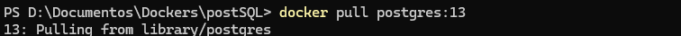

En donde con esto nos instalara una version de postgres, igualmente si queremos alguna versión valida en especifico debemos poner seguido de postgres ":version" o bien tener la versión mas actualizada debemos poner postgres ":latest"

```bash
docker pull postgres:latest
```
Una vez ya descargada la imagen para poder confirmarla debemos ejecutar el comando:

```bash
docker images
```
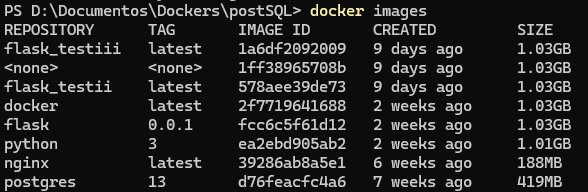

Para crear un Docker, tendremos que ejecutar el siguiente comando:

```bash
docker run --name nombreContenedor -e POSTGRES_PASSWORD=tuContraseña -d -p 80:80 postgres:13
```

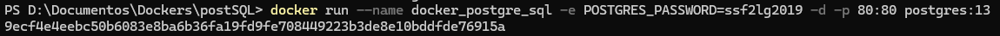
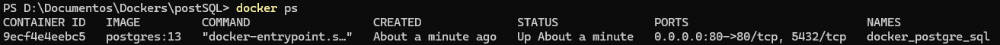
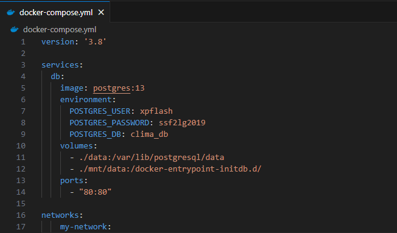
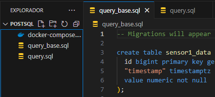
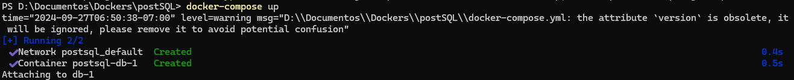
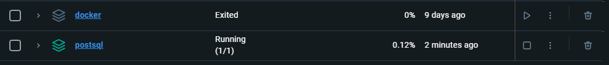
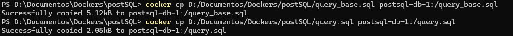

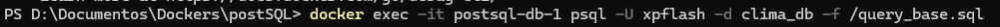
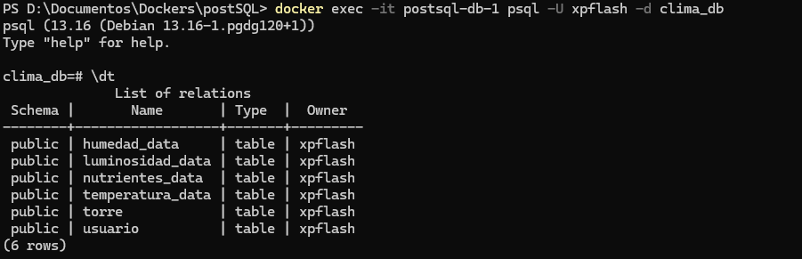
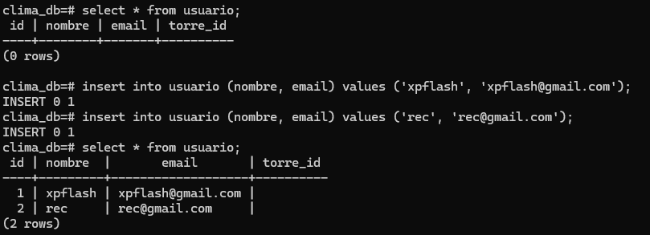
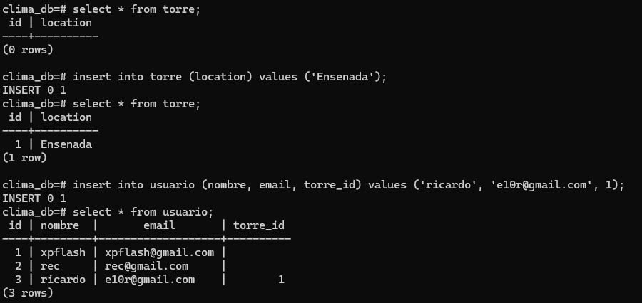
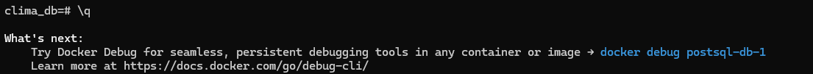
